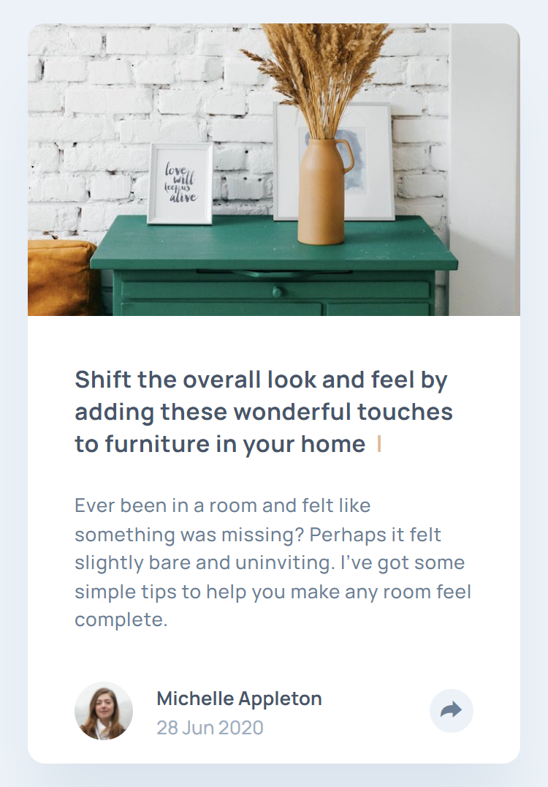
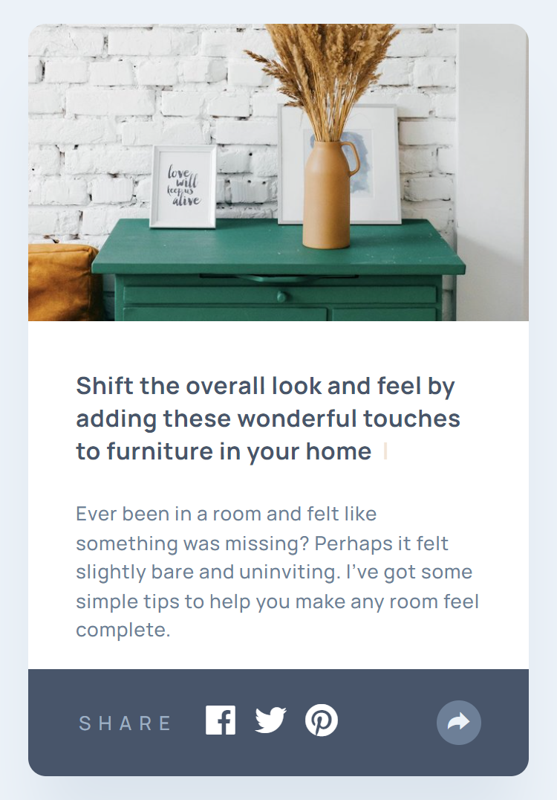
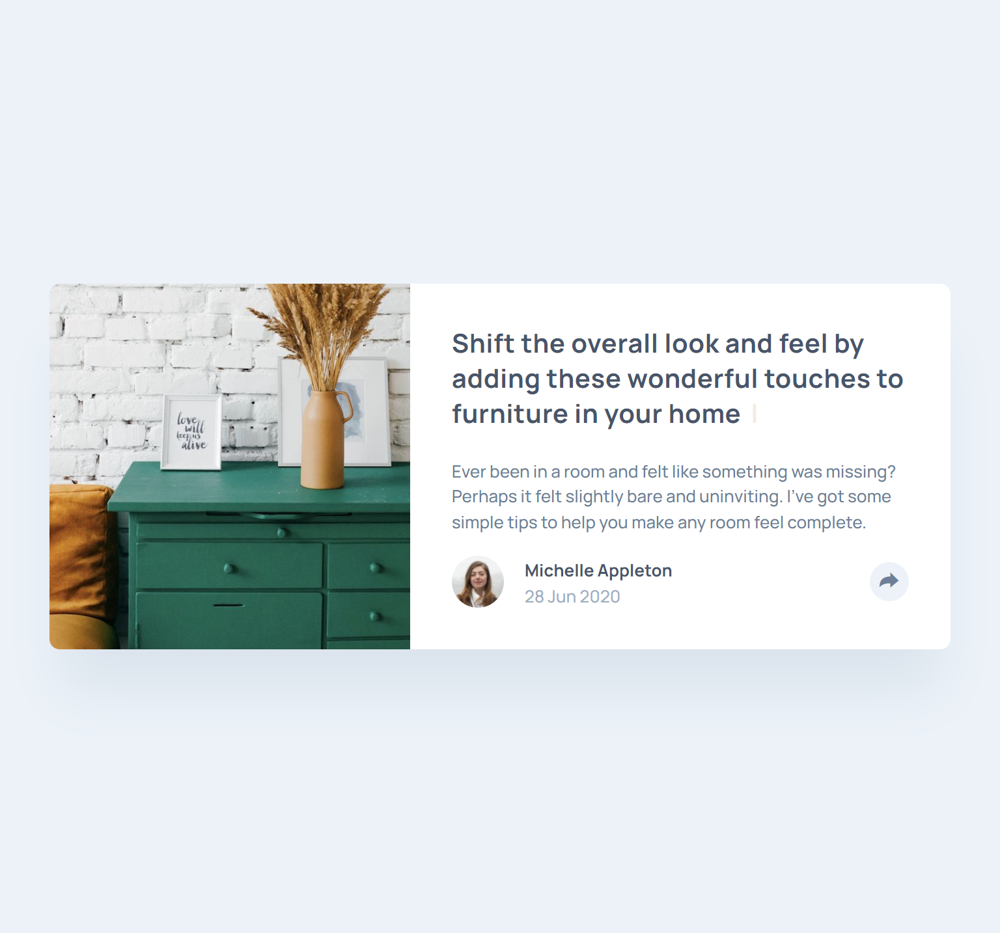
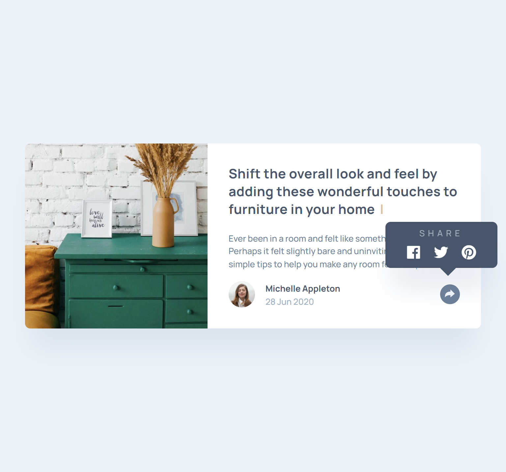
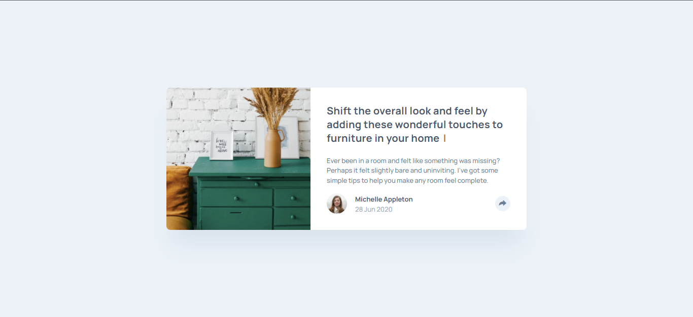
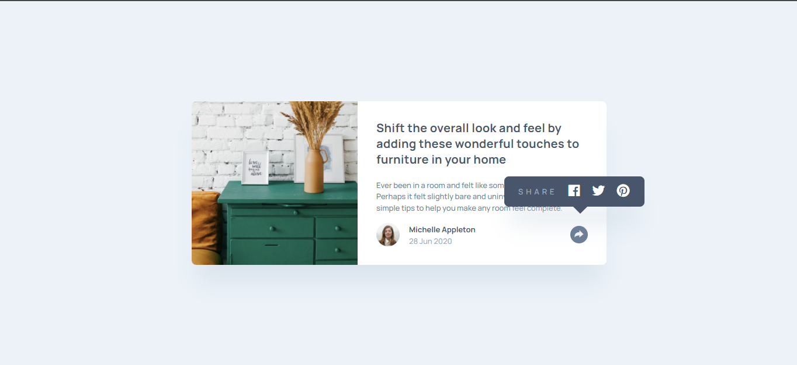

<h1 align="center">
  🤔  <a href="#">Article preview component</a>
</h1>

<h3 align="center"> 
  👀 Challenge Frontend Mentor
</h3>

  

  

  

  
    
  

<h4 align="center"> 
	🚧 Status: Finished 🚀
</h4>

 <a href="#-about">About</a> •
 <a href="#-layout">Layout</a> • 
 <a href="#-tech-stack">Tech Stack</a> • 
 <a href="#-author">Author</a> • 
 <a href="#-license">License</a>

## 📃 About

-   This was certainly an incredible project to carry out, it provided me with several challenges, especially in terms of positioning elements.

-   I took the liberty of adding a typewriter effect, done with javascript and keyframe(css), honestly, I thought it was really cool 😊

---

## 🎨 Layout

### 📱 Mobile

  

  

### 💻 Tablet

  

  

### 🖥 Desktop

  

  

---

## 🛠 Tech Stack

The following tools were used in the construction of the project:

-   Javascript
-   Sass/Scss
-   HTML
-   Boxicons:  **[Boxicons](https://boxicons.com/)**
-   Font family:  **[Manrope](https://fonts.google.com/specimen/Manrope)**

---

## 😎 Author

<b>Thiago Moreira</b>

Made with ❤️ by Thiago Moreira 👋🏽 Get in touch!

---

## ⚖ License

This project is under the license [MIT](./LICENSE)
